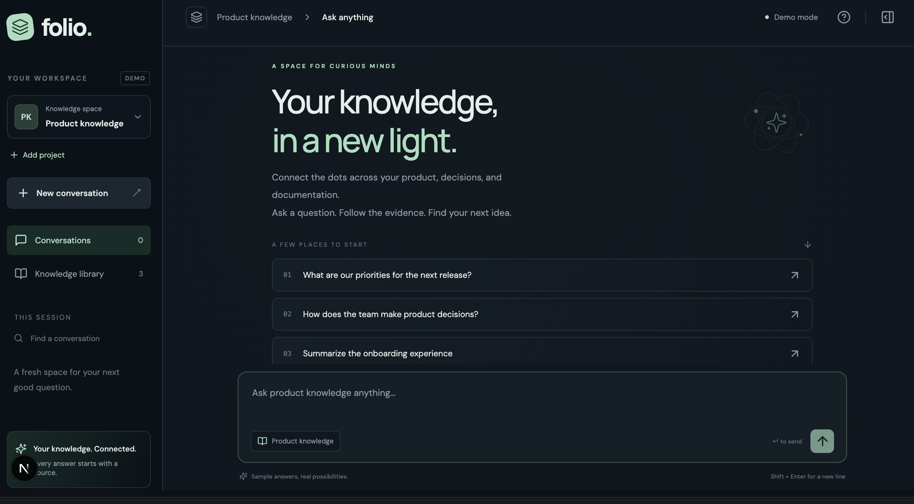
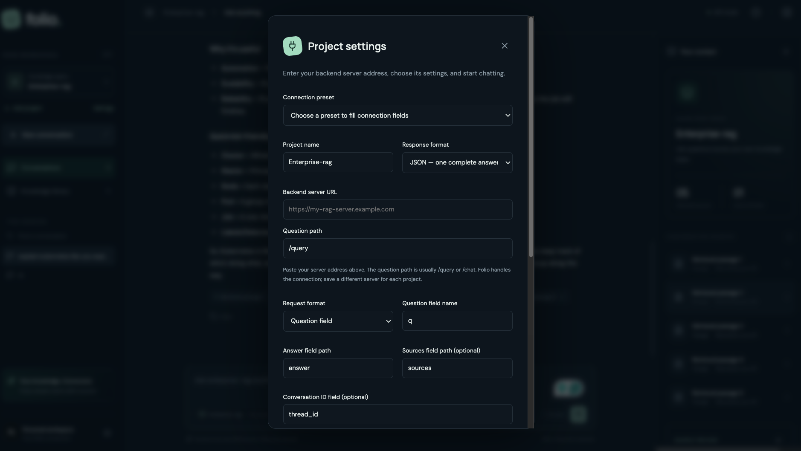

# Folio — a reusable frontend for RAG backends

Folio gives your RAG backend a chat interface. Add your backend server URL, choose
its request and response settings, and start asking questions.

Each project saves its own connection. You can use one server for one project
and a different server for another. New connections are set up entirely in the
app: no code edits, `.env` changes, app restart, or backend CORS setup are needed.

Folio is built with Next.js, React, and TypeScript. Your backend remains
responsible for retrieving documents and generating answers.



*The Folio workspace, shown with the Product knowledge demo project.*

## Run the app

Requires Node.js 20.9 or newer.

```bash
npm install
npm run dev
```

Open [http://127.0.0.1:3000](http://127.0.0.1:3000). The development server listens
only on your computer by default.

## Connect your backend

On your first visit, the connection form opens automatically. To add another
backend later, click **Add project**. To change a saved connection, select its
project and click **Settings**.



*Configure each project's backend connection in this panel.*

1. Enter a **Project name** — any name you want to see in the sidebar.
2. Paste your **Backend server URL**, such as `https://my-rag.example.com`.
3. Enter the **Question path**, usually `/query` or `/chat`.
4. Choose a **Connection preset**, or adjust the fields to match your backend.
5. Click **Send test question**. This sends a real question to the backend.
6. If an answer appears, click **Save project** and start chatting.

The server URL and question path are combined automatically:

```text
Backend server URL: https://my-rag.example.com/
Question path:     /query
Questions go to:   https://my-rag.example.com/query
```

Enter the server URL separately from the question path. A trailing slash on the
server URL is fine. If your backend lives under a prefix such as `/api/v1`, you
can include that prefix in the server URL.

### Example: the Cloud Run RAG backend

Use these settings for the backend shown below. Someone connecting a different
server enters their own URL and the fields their API expects.

| Setting                   | Value for this backend                              |
| ------------------------- | --------------------------------------------------- |
| Project name              | `Enterprise RAG`                                    |
| Backend server URL        | `https://rag-api-851836889082.us-central1.run.app/` |
| Question path             | `/query`                                            |
| Connection preset         | `RAG query — q + thread_id`                         |
| Response format           | `JSON — one complete answer`                        |
| Request format            | `Question field`                                    |
| Question field name       | `q`                                                 |
| Conversation ID field     | `thread_id`                                         |
| Answer field path         | `answer`                                            |
| Sources field path        | `sources`                                           |
| Include previous messages | Off                                                 |

The preset fills the request and response settings while keeping the server URL
you entered. Check the question path after changing presets.

Folio sends:

```json
{
  "q": "What is retrieval augmented generation?",
  "thread_id": "an-automatically-generated-conversation-id"
}
```

The backend returns an answer and optional supporting passages:

```json
{
  "answer": "RAG retrieves relevant information before generating an answer.",
  "sources": ["A supporting passage from your knowledge base."]
}
```

### What the settings mean

| Setting                   | What to enter                                                                                                                    |
| ------------------------- | -------------------------------------------------------------------------------------------------------------------------------- |
| Response format           | Choose JSON for one complete answer, or NDJSON if your backend sends Folio streaming events.                                     |
| Request format            | Choose a question field, a messages array, or the Folio conversation format to match your API.                                   |
| Question field name       | The name your backend uses for the question, such as `q`, `question`, `query`, or `input`.                                       |
| Conversation ID field     | The field your backend uses to remember a conversation, such as `thread_id` or `session_id`. Leave blank if it does not use one. |
| Answer field path         | Where the answer text appears in the response: for example, `answer`, `data.answer`, or `choices.0.message.content`.             |
| Sources field path        | Where supporting sources appear, such as `sources` or `data.documents`. Leave blank for answer-only APIs.                        |
| Include previous messages | Enable only if your question-style API accepts earlier messages in a `history` array.                                            |
| Model                     | Shown for the messages format. Fill it in only if your API requires a model name.                                                |

Use **Preview the request** to see the question body that will be sent.
**Export settings** and **Import settings** let you reuse a project connection
in another installation.

## What the app handles

- Sends questions to the server saved for the selected project.
- Creates conversation IDs and reuses them for follow-up questions.
- Creates a fresh ID when you start a **New conversation** or send a test question.
- Displays Markdown answers and supporting sources.
- Shows raw source strings as numbered retrieved passages. Source objects can
  also supply document titles, excerpts, and page numbers.
- Allows up to two minutes for a response and provides a stop button.
- Saves connection settings and your theme preference in this browser.

The browser sends requests through Folio's `/api/connect` route. Folio contacts
the backend from its server, so this connection flow does not depend on browser
CORS permissions.

Conversations currently stay in memory and disappear when the page is refreshed.
The backend may retain its own conversation records; Folio does not delete them.

## Supported backends and current limits

- The standard connection supports publicly reachable HTTP or HTTPS servers
  accepting JSON POST requests. Localhost and private network addresses are
  blocked by this route.
- Responses can be JSON or the documented Folio NDJSON stream. SSE and unusual
  request or source formats need a custom adapter or backend normalization.
- Redirects are not followed. Enter the final server URL and question path.
- Browser cookies and server environment API keys are not forwarded to a server
  entered in project settings. Backends requiring additional authentication need
  an authenticated gateway or a custom adapter.
- Folio does not yet include user login, saved chat history, file uploads, or
  document indexing. Add access control and rate limits before a shared deployment.
- The three sample projects use fictional documents and simulated answers. Saved
  backend projects use real API responses.

Older direct connections and the `/api/rag` route remain supported for
compatibility. The variables in `.env.example` apply only to that older route;
you do not need them when adding a backend through the new connection form.

## Troubleshooting

| Problem                  | What to check                                                                 |
| ------------------------ | ----------------------------------------------------------------------------- |
| Cannot reach the backend | Confirm the server is running and its URL is publicly reachable.              |
| HTTP 404                 | Check the question path. The API may use `/chat` instead of `/query`.         |
| HTTP 422                 | Check the request format, question field, and required conversation ID field. |
| No answer text found     | Check the answer field path against the backend's JSON response.              |
| No sources appear        | Check the sources field path and whether the backend returned any sources.    |
| Request times out        | Check the backend logs; Folio allows two minutes for a response.              |

## Development

```bash
npm run typecheck
npm test
npm run build
npm start
```

`npm start` runs the production build after `npm run build` succeeds.

| File                               | Purpose                                                          |
| ---------------------------------- | ---------------------------------------------------------------- |
| `src/components/project-setup.tsx` | Backend connection form, testing, import, and export             |
| `src/components/workspace.tsx`     | Chat, conversations, and source previews                         |
| `src/lib/project-profiles.ts`      | Saved settings, presets, and request mapping                     |
| `src/lib/project-adapter.ts`       | JSON answers and source mapping                                  |
| `src/lib/http-adapter.ts`          | Folio NDJSON streaming                                           |
| `src/app/api/connect/route.ts`     | Entry point for connections configured in the app                |
| `src/lib/connect-backend.ts`       | Validates requests and forwards the selected project's payload   |
| `src/lib/public-backend.ts`        | Checks public destinations and connects to the validated address |
| `src/lib/backend-url.ts`           | Combines and validates server URLs and question paths            |
| `src/lib/rag-proxy.ts`             | Older environment-configured gateway                             |
| `src/lib/*.test.ts`                | Connection, mapping, streaming, and cancellation tests           |
| `src/app/globals.css`              | Themes and responsive layout                                     |

See [QUICKSTART.md](QUICKSTART.md) for more connection examples and
[FASTAPI_INTEGRATION.md](FASTAPI_INTEGRATION.md) for the API contracts.

Google Fonts supplies DM Sans and Manrope, with system fallbacks. Self-host these
fonts if you need an offline deployment.
